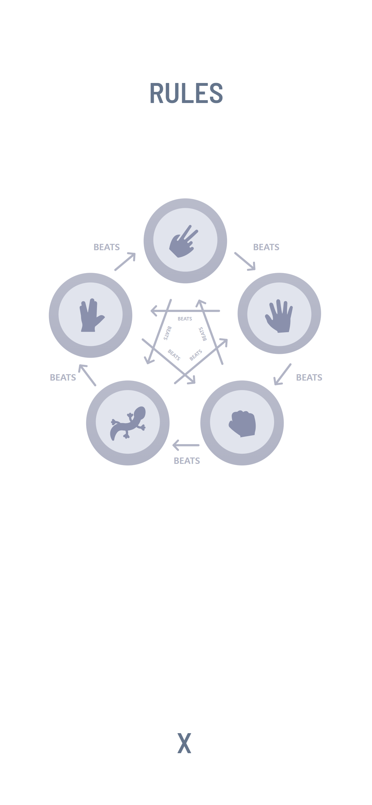
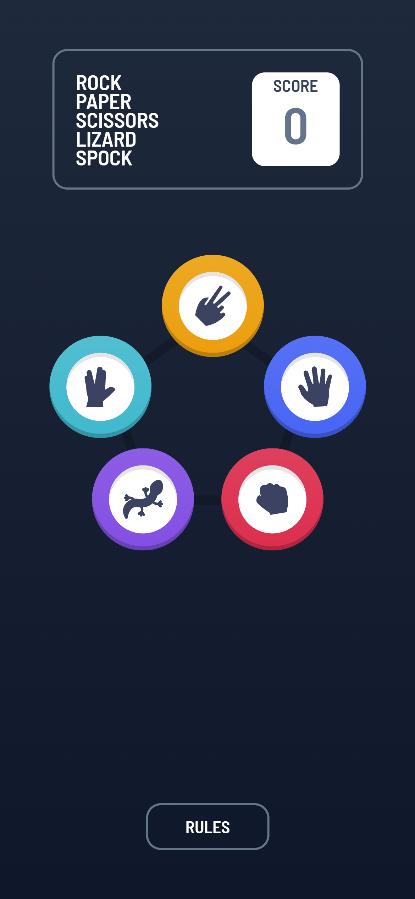
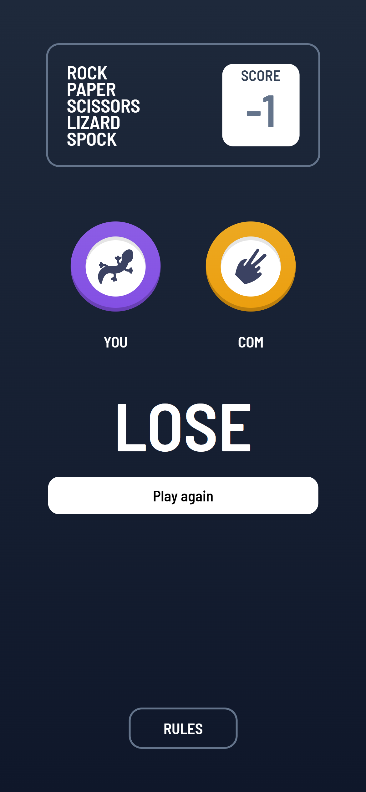

# Frontend Mentor - Rock, Paper, Scissors solution

이 솔루션은 [Rock, Paper, Scissors challenge on Frontend Mentor](https://www.frontendmentor.io/challenges/rock-paper-scissors-game-pTgwgvgH) 챌린지 참여 결과물입니다.

## 차례

- [소개](#소개)
  - [챌린지](#챌린지)
  - [화면 스크린샷](#화면-스크린샷)
  - [링크](#링크)
- [배운 점](#배운-점)
  - [사용 tool](#사용-tool)
  - [새롭게 배운 것](#새롭게-배운-것)
  - [앞으로 배울 것](#앞으로-배울-것)
  - [참고 사이트](#참고-사이트)
- [제작자](#제작자)
- [기타사항](#기타사항)

## 소개

### 챌린지

Rock, Paper, Scissors의 확장판으로
5개짜리 가위바위보인
Rock, Paper, Scissors, Lizard, Spock을 만들었다.

### 화면-스크린샷

### 링크

- Solution URL: [Github](https://github.com/juurom/RPS___frontendMentor/)
- Live Site URL: [Live Site](https://juurom.github.io/RPS___frontendMentor/)

## 배운-점

### 사용-tool

- REACT
- tailwind css

### 새롭게-배운-것

react hook에 관해 배울 수 있었다.
더 나은 가독성을 위해 TIL로 따로 정리했다...
[링크는 여기](https://velog.io/@juurom/TIL-useEffect-invalid-hook-call)

### 앞으로-배울-것

이제 연습 고만하고 개인프로젝트 해야지!
내 마지막 클론과제였다고 생각한다~~~.

## 제작자

- Github - [@juurom](https://github.com/juurom/)
- Frontend Mentor - [@juurom](https://www.frontendmentor.io/profile/juurom)

## 기타사항
invalid hook call 때문에 너무 화났다.
개발 배우면서 화가 많아지는 것 같다.
그렇지만 사람은 화내면서 성장하는 법(?)
열심히 해보장.